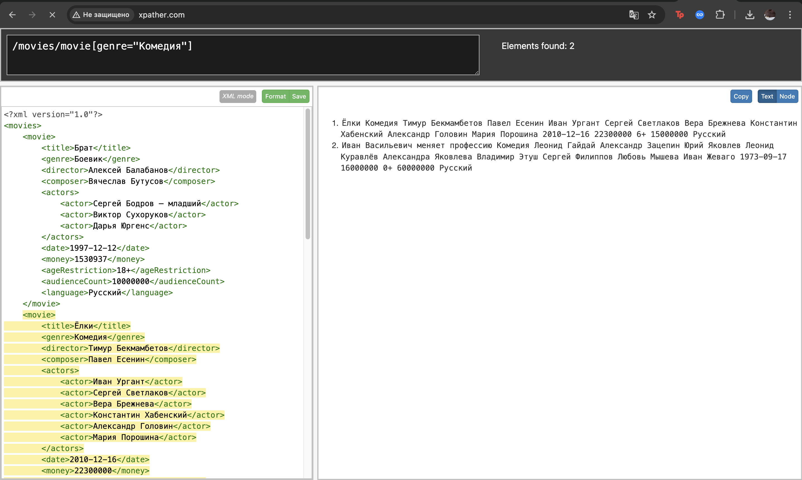
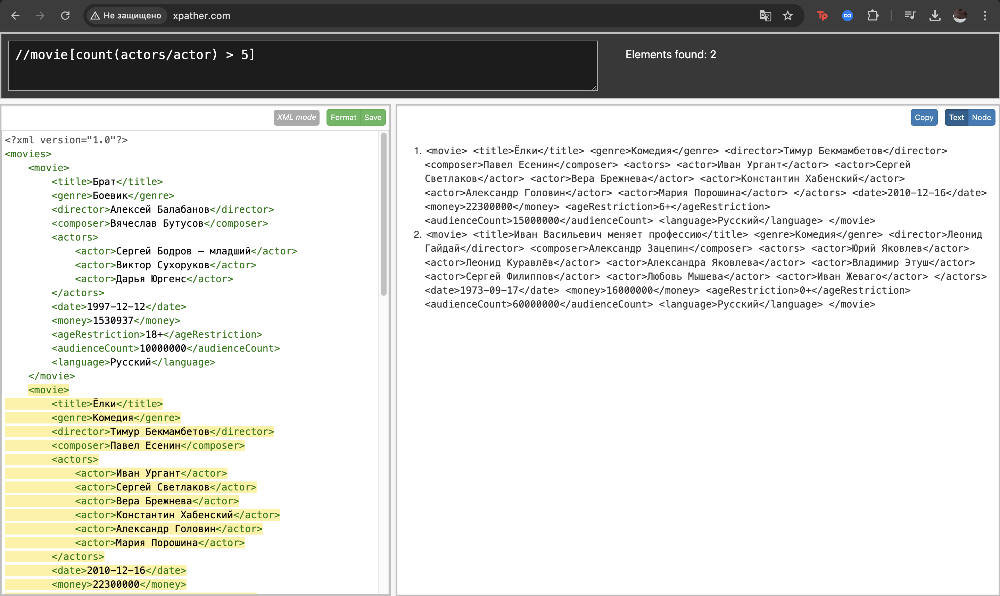
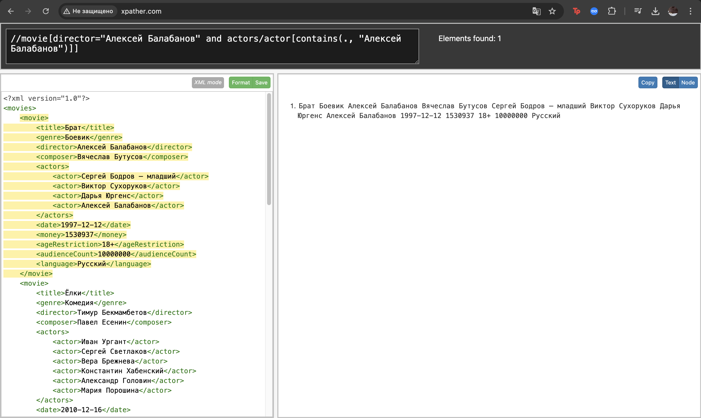
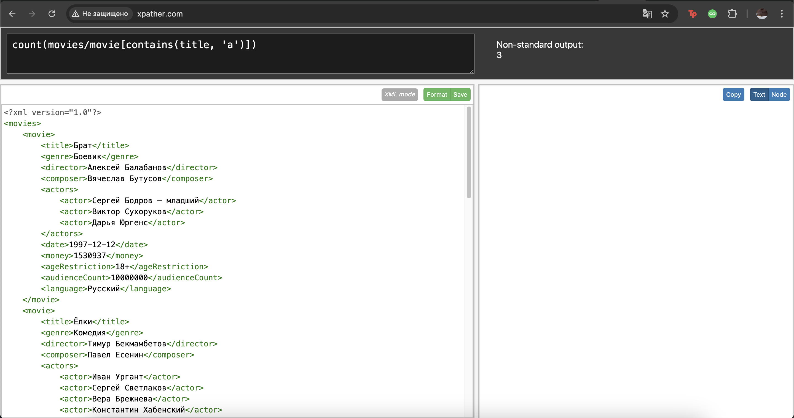
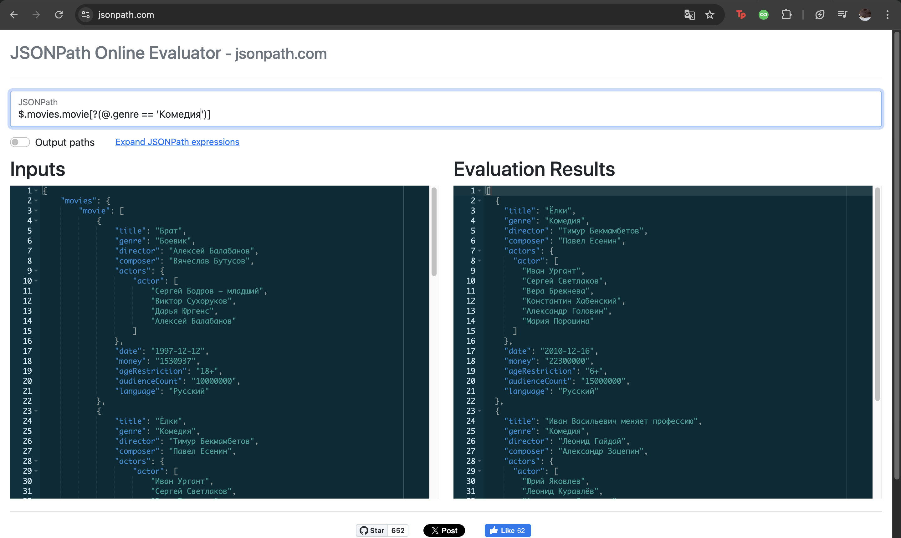
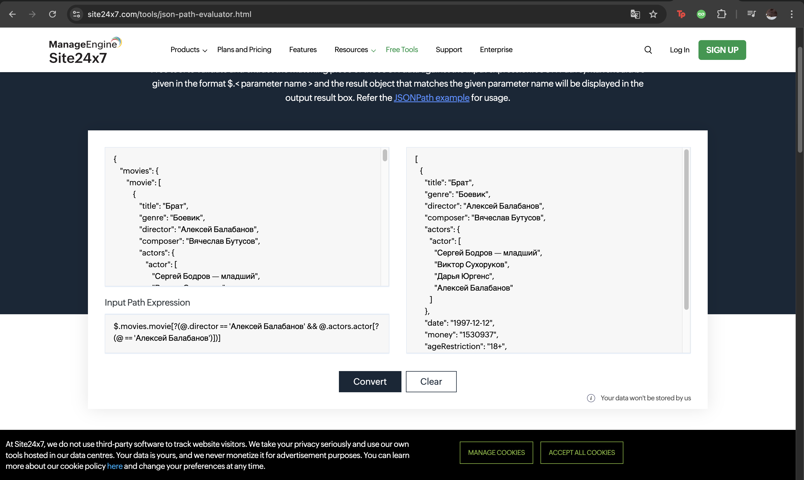

***XML***
2a) Получить все фильмы указанного жанра (задается в запросе константой): /movies/movie[genre=”Комедия”]
    
2b) Получить все фильмы с актерским составом более пяти человек: //movie[count(actors/actor) > 5]
    
2c) Получить все фильмы, в которых указанный человек (задается в запросе константой) является и режиссером, и актером одновременно: //movie[director="Алексей Балабанов" and actors/actor[contains(., "Алексей Балабанов")]]
    
2e) Собственный запрос с использование минимум двух функций count(), contains(), position(), sum() и др: count(movies/movie[contains(title, 'а')])
    
***JSON***
2a) Получить все фильмы указанного жанра (задается в запросе константой):
    
2c) Получить все фильмы, в которых указанный человек (задается в запросе константой) является и режиссером, и актером одновременно:
    